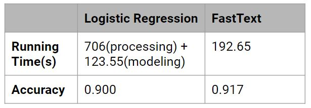

# Amazon Reviews Sentiment Analysis
## Introduction
Our project used a large dataset(https://nijianmo.github.io/amazon/index.html), which contains over 20 million reviews from 24 departments to create a user interface, that could help amazon merchant to deal with large amount of reviews everyday.

## Requirements
```
dash==1.0.2
dash-daq==0.1.7
numpy>=1.16.2
pandas>=0.24.2
```

To install all of the required packages, run 
```
pip install -r requirements.txt
```

For installing fasttext module, check the official documentation(https://fasttext.cc/docs/en/support.html)

## Notebook
All code written in jupyter notebook is stored in `notebook/` folder. 

`preprocessing.ipynb` contains all code that processing the data before we plotting and training the model, the original data is downloaded from the link we give in the first line.

`descriptive_EDA.ipynb` contains all code that used in first stage, EDA part, we explore every feature in our dataset, and come out with two problems that we are interested, can we define TRUE customer and how does number of reviews change among the time. 

`descriptive_EDA_Text_Related.ipynb` contains all code that used in EDA for review contents. We analyzed the length of reviews and the count of reviews by time for each department as well as the top frequent words in each department. 

`Model_Training.ipynb` contains all code that used to train the baseline and fasttext model. The training set and test set data is download from (https://www.kaggle.com/bittlingmayer/amazonreviews)

`Data preparation for user interface.ipynb` contains all code that processing the data before we used them in the user interface. It is important to make our user interface fast and accurate. We decided to pre-precess and pre-calculate the needed data and store it in the user interface folder. 

To use those notebook, first download the dataset in `original/` folder, you can check the README file in that folder for detail information, and run the `preprocessing.ipynb` notebook, then all the processed data will be stored in `data/` folder. 

Then you can run `Model_Training.ipynb` to get saved model file, or you can just download it (https://drive.google.com/file/d/17D1GUAPH61mfHAWHURxlPtVWIkRZacPw/view), and run `Data preparation for user interface.ipynb` to get a subsets of data (or download from https://drive.google.com/file/d/1vwJUazI0SJvfbLMIKPJ0e421A28MOWbl/view?usp=sharing) and a dictionary of weights that will be used to draw word cloud.

## Dashboard
All code and necessary file used for dashboard is stored in `dashboard/` file. In order to run the dashboard in your local computer, use following commands:
```
cd dashbard
python app.py
```
folder `dashboard_data/` contains the pre-trained model and a dictionary of weights that used to draw word cloud. 
The data used can be found in below link:

https://drive.google.com/file/d/1vwJUazI0SJvfbLMIKPJ0e421A28MOWbl/view?usp=sharing
https://drive.google.com/file/d/17D1GUAPH61mfHAWHURxlPtVWIkRZacPw/view?usp=sharing

Please download them and unzip them to the dashboard_data for the user interface to run.

The user guide of dashboard can be found in `user_manual.md`.

### modeling
The baseline model is logistic classification. Logistic model needs tokenized and vectorized text data as input so it is time consuming when implement it into user interface.
The final model used in the user interface is a fasttext model which is faster and more accurate than traditional classification model.



### Ver 1.0 User Interface
In settings tab, users can select the target departments and input one comment to get the positive or nagative label for it. All the data i will be updated by clicking on the submit button.

In result summary tab, if the input comment is postive, the sentiment analysis result will be 1 in the LED chart, otherwise the result will be 0. Key words based on word frequency are used in the word cloud. The word cloud is generated from the data in the UI database accoreding to the department selected by the user.

### Ver 2.0 User Interface
Add time slider, department summary table and pie chart of rating distribution in result tab. Department summary table shows the number of comments. The pie chart shows the rating distribution under selected label. Both charts are linked with the selected department, time slider and sentiment labels. 

Add positive, negative and all labels in result tab. Users can select the label and the time to show the wordcloud of the keywords under this label during the selected time period. 

Add summary table in settings tab to show the summary of input data.

Add more info about this product link. This link will redirect user to the amazon page of this product.

### Ver 3.0 User Interface
Upload/download function: this function is added to settings tab. Users can upload their own comments file and the web app will process it once the user clicks on the submit button. The uoloaded file and processed file are listed on the page for user to download. The summary table in settings table are showing the infomation of uploaded file if there is one. The word cloud are showing the key words from uploaded file if there is one. The word cloud is only linked with the sentiment label under this situation and it will not be updated even if users seletced different time period.

Update sentiment analysis result: change the exact number to percentage.

Product id input textbox: users can input their product id if they want the history comments and rating distribution as well as the purchase rate and comment image rate for this product. User can get these information by click on the **learn more** button in the result summary page.

Report button: report button is added for users to report the wrong predictions.

## Changes and Learnings
### Changes
The initial thought is to give a comprehensive app for amazon sellers to analyze the comments sentiment and user rating bias. When we started to build the interface, we realized that it is important to make the app straight to the point and easy-to-use. So the final version of this app contains sentiment analysis, rating distribution and various charts that support the sentiment result and rating. Other ideas in the initial thoughts could be extensions for the app.

### Learnings
**Text analysis**
* Large dataset TF-IDF calculation

**Dashboard/website building**
* HTML/CSS properties (no background knowledge)Store data in one callback and use it in another
* Upload file and download file in dash
* Design for better user experience

**Thinking from user’s standpoint**
* Add summarize table to give a more straightforward result


