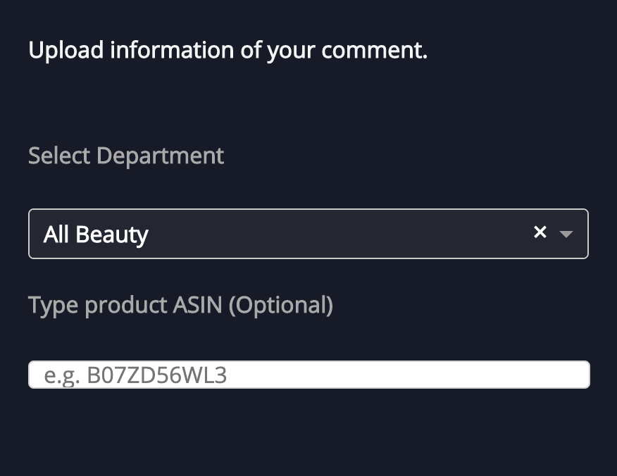
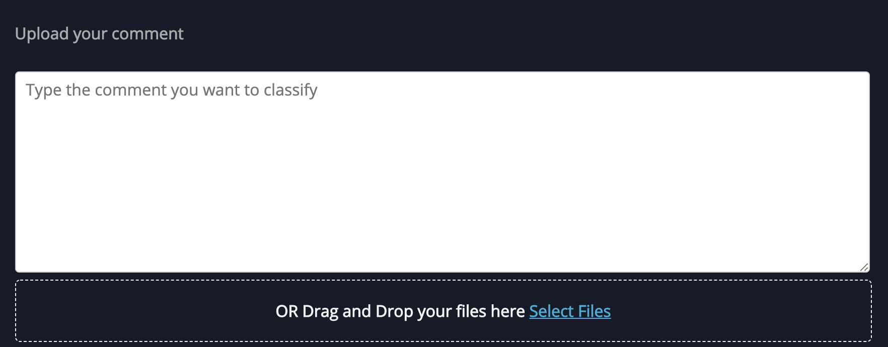
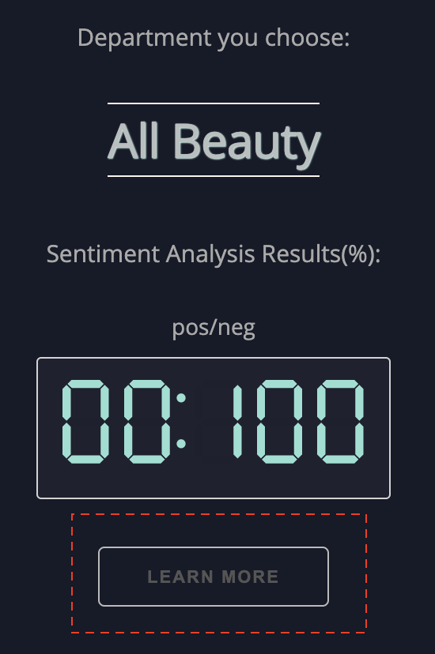
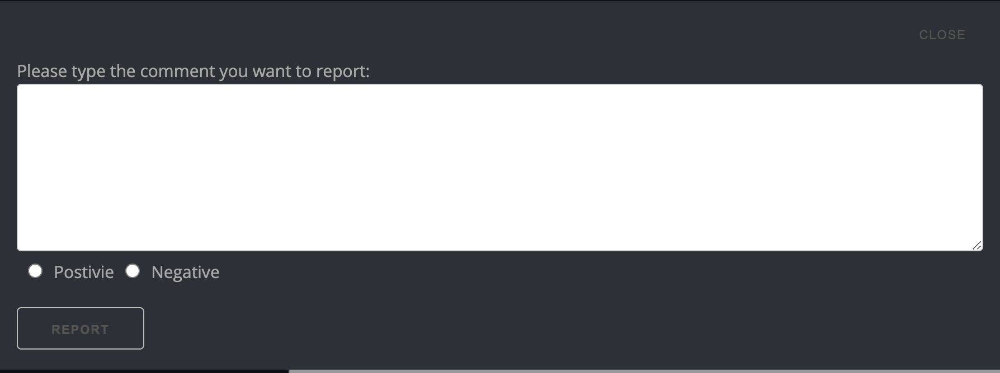

# User Guide
**Authors: Boya Zhang, Jiaxuan Wu**

## 1. Introduction

### 1.1 Project summary
Our project, **Amazon Reviews Sentiment Analysis** used a large dataset, which contains over 20 million reviews from 24 departments to create a user interface, that could help amazon merchant to deal with large amount of reviews everyday.

### 1.2 Model
Our project used a fast pre-trained text model, **fasttext** model as our underlying model for user interface. The model is trained previously in our dataset on 3 millions data and test on 400k data, the accuracy is more than 91%.

## 2. How to use our UI -- Input:

### 2.1 Summary
**Input**: \
Department, productID(optional), reviews(csv file or directly input in text box).\
**Output**:\
Sentiment analysis results, explanatory plots.

There are two tabs, **Setting** and **Results Summary**, user input necessary informations in **Setting** tab and get all the results in **Results Summary** tab.\

There are three modes of our user interface, **first mode**: not given any comments but only see the explanatory plots, **second mode**: user could try the function of our UI by type ONE comment in text box located in the right of setting tabs. **third mode**: after you are familar with our UI, you can upload a csv file of comments you want to process.

### 2.2 First mode
You can just given the department you are interested at by select in the dropdown menu showed in graph below, and also you can provide product ID if you want. Then clikc the **Show Results** to update the information, therefore, you can get the result in **Results Summary** tab.

### 2.3 Second mode
You can type any comment you want to classify in the text box (showed in image below) to play with our user interface, by clicking **Show Results** to update information and get a quick summary of prediction results in table showed.

### 2.4 Third mode
After you have a basic idea of how does this UI words, you can try to upload several comments in the upload box. Here is the <a href="user_guide_utils/test.csv">demo test file</a>, first column is the summary of review, second column is the content of reviews. And then click the **Show Results** button, you can see the **summary table**, which shows a summary of prediction result and **processed file**, which contains the prediction results that can be downloaded if you want.

### 2.5 Input product ID
This is an optional input we provide, since our dataset contains lots of different products' previous record, if you provide us the product ID, we can search in our database to find any related records and provides the plot. You can check the results correlated to given product ID by click **Learn More** button in **Results Summary** tab. Check the image below to find the location.

### 2.6 Report
Even though our model performs very well and have a 91% accuracy, there are still some wrong predictions, if you find any error, feel free to use the report function by clicking the **report** button and type the comment that is classified into wrong category. Here is the report window:

## 3. How to use our UI -- Output

### 3.1 Choose what you want to show
In the **Results Summary** tab, we give two options, select the **sentiment** and **most recent months** to choose for showing the plot. You can choose to use the data that are all positive reviews, negative reviews or all of them. And also you can choose to use the past 3 months data, past 6 months data, past 1 year data or past 2 years data.

### 3.2 Word Cloud
In order to better show the keyword, we use word cloud to display our result. We draw the word cloud based on the value of tf-idf, so if you only upload one comment, we cannot extract keywords from a single one, so we will display the keywords of the whole department you choose. 

### 3.3 Other plots
Except the word cloud mentioned in 3.2, we also provide other plots. In the right of word cloud graph, we show the summary table and rating distribution of the department you choose in order to let you have some insights of the overall picture of this department. 

The plots of product ID graph will be showed below the word cloud graph by clicking the **Learn More** button, detailed explanation is showed in 2.5.

## 4. Frequently asked questions
### What model do you use for classifying sentiment?
Fast text model (https://fasttext.cc), the performance and our model results is showed in 1.2.

### What's the format of upload file?
Currently, we only accept csv file, first column contains the summary of review, second column contains the main content of the review, you can download the demo test file in 2.4 to check.

### Which criteria do you use to plot the word cloud?
We use TF-IDF to sort the keywords, we consider all reviews in one department as one document to calculate document frequency, term frequency is calculated from given reviews if we have a list of reviews or use the reviews in our dataset. You can also check section 3.2 for further information.

### Do I must provide comment if I want to use this UI?
No, you can just give the department you are interested about and get the explanatory plots, see section 2.2 for more information.

### If I only have one comment, can I use this UI?
Yes, you can use textbox(see section 2.3) to give the comment or save it as a csv file(see section 2.4).

